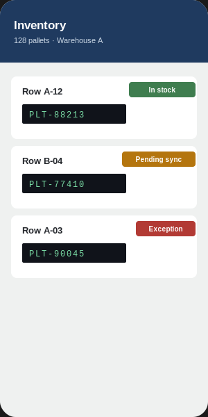
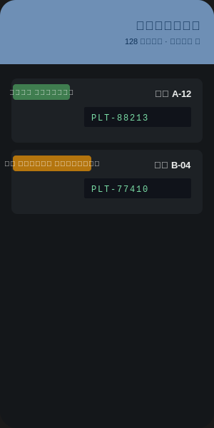
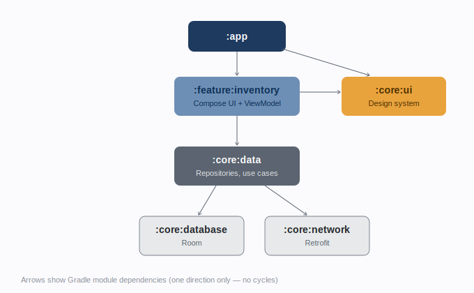

# WarehouseFlow

Offline-first warehouse inventory tracking for Android, built the way a real
warehouse management system for handheld scanners is built in production —
not a tutorial demo.

## What this is

Pallets move through a warehouse faster than a phone can hold a network
connection. WarehouseFlow lets an operator scan a pallet barcode, see its
status, and update it — all offline, syncing to the backend the moment a
connection comes back. It's a generalized rebuild of patterns from real
warehouse management systems I've shipped for manufacturing and logistics
clients, redesigned from scratch as a standalone, client-agnostic project.

## Screenshots

<table>
<tr>
<td align="center"> Light &middot; English</td>
<td align="center"> Dark &middot; Arabic (RTL)</td>
</tr>
</table>

Every screen ships in English and Arabic from day one, with full RTL layout
mirroring — scanned codes stay left-to-right even inside a right-to-left
screen, matching how the codes are actually printed on the pallet label.

## Architecture

The app is split into independent Gradle modules instead of one `:app`
module organized into packages. That difference is deliberate, not
decorative:

| | Single module (packages only) | This project (Gradle modules) |
|---|---|---|
| Boundary enforcement | Convention only — anything can import anything | Compiler-enforced — `:core:database` can't leak into `:feature:inventory` unless explicitly exposed |
| Build time | Any change recompiles the whole app | Gradle rebuilds only the modules that changed |
| Team scaling | Everyone edits the same module | Features can be owned and reviewed independently |

**Module map**

- `:app` — composition root, navigation graph, entry point only
- `:feature:inventory` — screens, ViewModels, the barcode scanner (CameraX + ML Kit)
- `:core:data` — repositories and use cases; the only module that decides "database vs. network vs. both"
- `:core:database` — Room entities and DAOs
- `:core:network` — Retrofit API and DTOs
- `:core:ui` — design system: color, type, shape tokens and shared components

Dependencies point one direction only, `:feature` → `:core`, never back —
Gradle refuses to build a cycle, which keeps the architecture honest rather
than aspirational.

## Design system

Built to avoid the two generic Android looks (default Material You purple,
or an unstyled Bootstrap-y look):

- **Palette** drawn from the warehouse floor itself — an equipment-paint
  indigo as primary, a single safety-amber accent (from hazard striping),
  and status colors tied to real operational states rather than generic
  green/red.
- **Typography** pairs IBM Plex Sans with IBM Plex Sans Arabic — a type
  family IBM designed to share the same rhythm across both scripts, so
  neither language feels like an afterthought.
- **Scan readout chip** — the one signature element: scanned codes render
  in a monospaced, LED-green readout styled after the handheld scanner's own
  display, so the UI visually acknowledges the hardware it runs on.
- Two explicit theme modes (light / dark) plus system default, not just a
  system-follow toggle — warehouse floor lighting varies more than office
  lighting does.

## Tech stack

| Layer | Choice |
|---|---|
| UI | Jetpack Compose, Material 3 |
| DI | Hilt |
| Local persistence | Room |
| Networking | Retrofit + OkHttp |
| Barcode scanning | CameraX + ML Kit Barcode Scanning |
| Concurrency | Kotlin Coroutines + Flow |
| Architecture | Clean Architecture, MVVM, multi-module Gradle |

## Status

Actively built in public, module by module. See the
[project board](../../projects) *(placeholder — link your GitHub Projects
board here)* for what's shipped vs. in progress: unit tests for the domain
layer and a GitHub Actions CI pipeline are next.

## Author

Mohammad Elaskary — Senior Android Developer.
[LinkedIn](#) &middot; [Portfolio](#)
